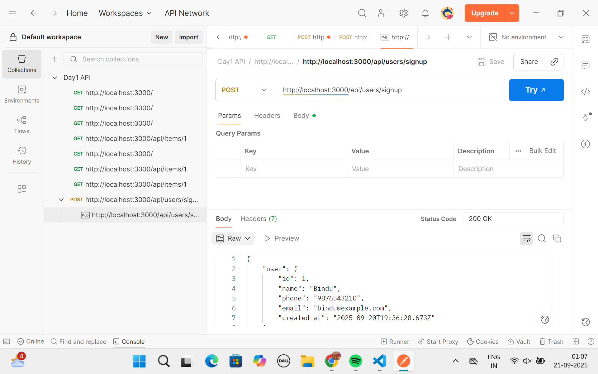
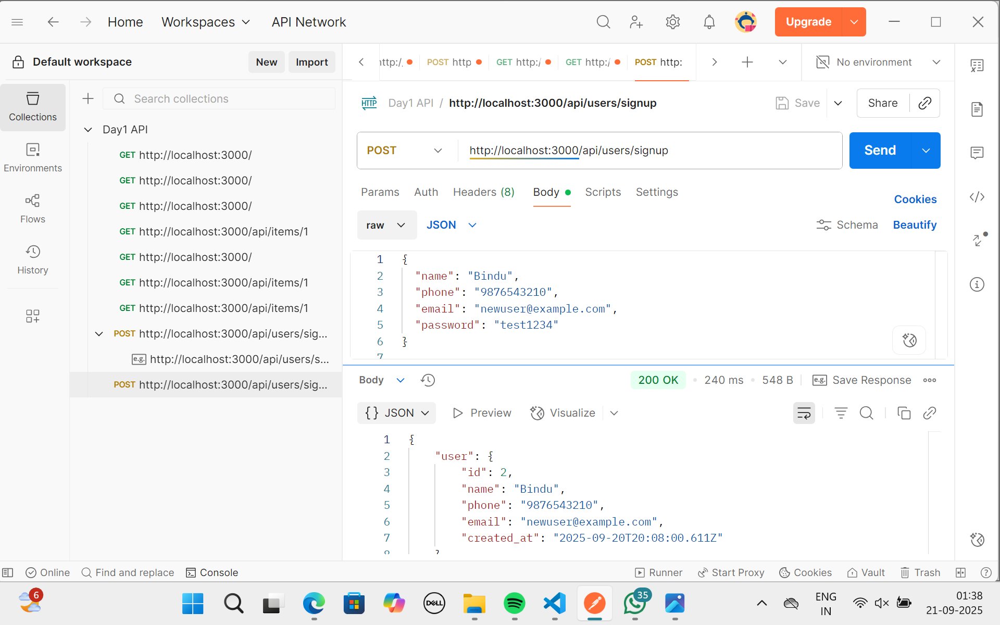

# Auth Backend (Express + Postgres + JWT)

## Description
This is a backend API for user authentication using Node.js, Express, PostgreSQL, and JWT.  
It supports user signup, signin, and protected profile routes.

## Features
- User registration with validation
- Password hashing using bcrypt
- JWT-based authentication
- Protected profile route (`/api/me`)

## Project Structure
backend/
├─ src/
│ ├─ db.js # PostgreSQL connection
│ ├─ index.js # Main server
│ ├─ routes/
│ │ └─ users.js # Signup & signin routes
│ └─ middleware/
│ └─ auth.js # JWT authentication middleware
├─ .env # Environment variables (not pushed)
├─ package.json
├─ package-lock.json
└─ README.md


## Setup Instructions

1. **Clone the repository**
```bash
git clone https://github.com/<username>/<repo-name>.git
cd day2-task2/backend


Install dependencies

npm install


Create .env file (copy from .env.example):

DB_USER=intern
DB_PASSWORD=intern123
DB_HOST=localhost
DB_PORT=5432
DB_DATABASE=day1db

JWT_SECRET=your_secret_key
JWT_EXPIRES_IN=7d

PORT=3000


Run the server

npm run dev


Server will start at http://localhost:3000

API Endpoints
1. Sign Up
POST /api/users/signup
Body: { name, phone, email, password }

2. Sign In
POST /api/users/signin
Body: { email, password }

3. Profile (Protected)
GET /api/me
Header: Authorization: Bearer <token>

Testing (Postman / Browser)

Sign up with new email → should succeed




Sign up with existing email → should return error
screenshots/signuperror.png


Sign in with correct credentials → should succeed

screenshots/signin.png

Sign in with wrong credentials → should return error

screenshots/signinerror.png

Access protected route with token → should succeed
screenshots/authorization1.png
screenshots/authorization.png


Access protected route without/invalid token → should return unauthorized
screenshots/inavlidtoken.png


